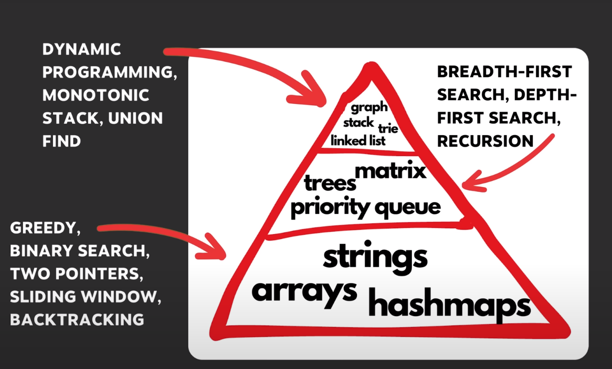

# Coding Test

deleting first commit: "git update-ref -d HEAD"

# LeetCode
##### Greatest Common Divisor of Strings (MAR/09/25) - O
##### Can Place Flowers (MAR/10/25) - O 
##### Reverse Words in a String (MAR/10/25) - O
##### Kids with the Greatest Number of Candies (MAR/11/25) - O
##### Reverse Vowels of a String (MAR/11/25) - O
##### Contain Duplicate (MAR/11/25) - O
##### Increasing Triplet Subsequence (MAR/11/25) - O
##### Longest Repeating Character Replacement (AUG/05/25) - X
##### Time Based Key-Value Store (AUG/11/25) - X
##### Top K Frequent Elements (AUG/14/25) - X O
##### Product of Array Except Self (AUG/15/25) - X
##### Is Subsequence (AUG/17/25) - O
##### Two Sum (AUG/17/25) - O
##### String Compression (AUG/17/25) - X
##### Move Zeroes (AUG/18/25) - O
##### Valid Anagram (AUG/18/25) - O
##### Group Anagrams (AUG/19/25) - O
##### Valid Sudoku (AUG/20/25) - X X X O O
##### Longest Consequtive Sequence (AUG/21/25) - X
##### 3Sum (AUG/22/25) - X 
##### Container with most water (AUG/24/25) - X O O O O
##### Trapping Rain Water (AUG/25/25) - X
##### Valid Palindrome II (AUG/26/25) - X O O
##### Valid Parentheses (AUG/27/25) - X
##### Generate Parentheses (AUG/28/25) - X O
##### Daily Temperatures  (AUG/29/25) - X O
##### Valid Palindrome (AUG/30/25) - O 
##### Min Stack (AUG/30/25) - X
##### Evaluate Reverse Polish Notation (AUG/31/25) - O
##### Car Fleet (AUG/31/25) - O
##### Search A 2D Matrix (SEP/01/25) - O O
##### Find Minimum in Rotated Sorted Array (SEP/02/25) - X
##### KoKo Eating Bananas (SEP/03/25) - X
##### Best Time to Buy A Stock (SEP/04/25) - O
##### Longest Substring Without Repeating Characters (SEP/05/25) - X

# BaekJoon 
##### Greedy
##### 잃어버린 괄호 - 1541 (JAN/17/25) - X O
##### 주식 - (JAN/18/25) - X    

